```{r setup}
library(tidyverse)
library(mosaic)
library(reshape)
```

## A Little Bit About Met

- I'm in the **MAPS** (Mathematics & Physical Sciences) department
- I mostly teach Statistics, Computer Science, and Data Analytics Courses
- My undergraduate degree is in Mathematics & Statistics
- My graduate degree is in Statistics & Operations Research
- I'm grew up just outside New York City

## Why should you study Math and Statistics?

- The demand for quantitative skills is outpacing nearly every other field.
- Extremely high earning potential

. . .

:::{.incremental}
- [Because it's hard](https://www.youtube.com/watch?v=oYJRwgHEFS0)
- Doing hard stuff is rewarding and will prepare you for success
- You will have more flexibility 
- Jobs requiring strong quantitative skills are consistently ranked as having the highest quality of life
:::

## Major's In Our Department

- Mathematics
- Physics - Mathematics
- Computer Science - Mathematics
- Data Analytics (new 3+1 program)

# Population Genetics

## Let's begin with a biology lesson!

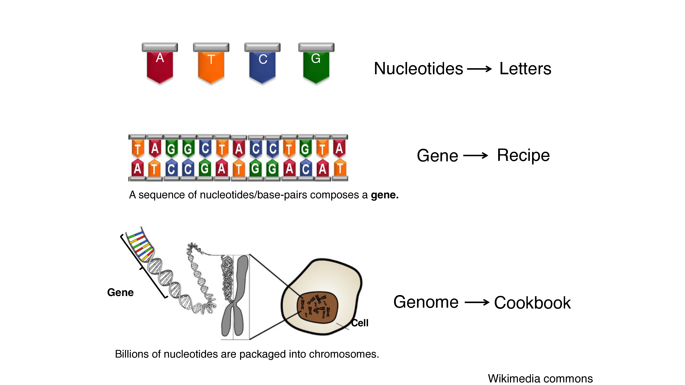{.r-stretch fig-align="center"}

## Let's begin with a biology lesson!

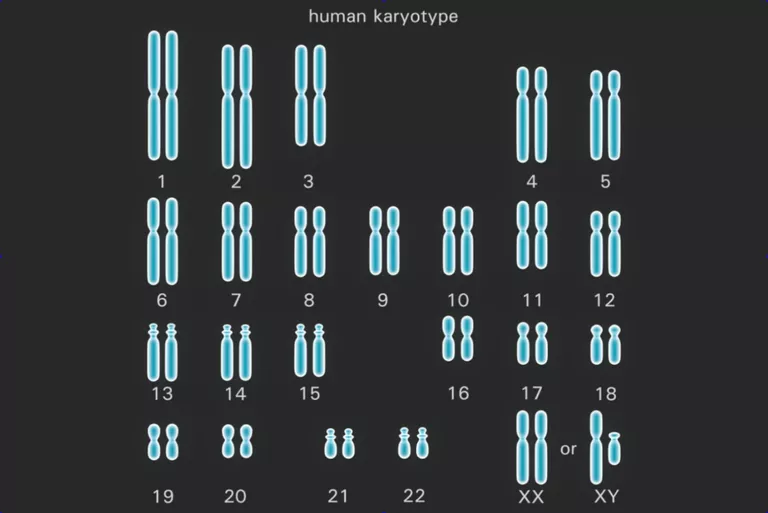{.r-stretch fig-align="center"}

## Big Picture: Questions about evolving populations

- What was the past size and structure of populations?

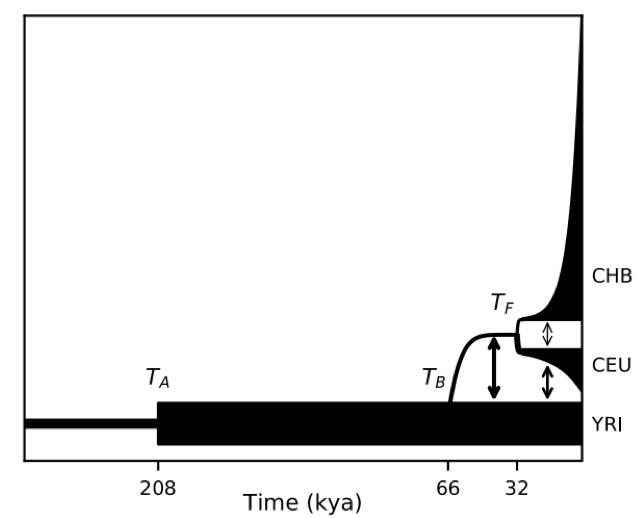{.r-stretch fig-align="center"}

## Big Picture: Questions about evolving populations

- Where in the genome is natural selection occurring?

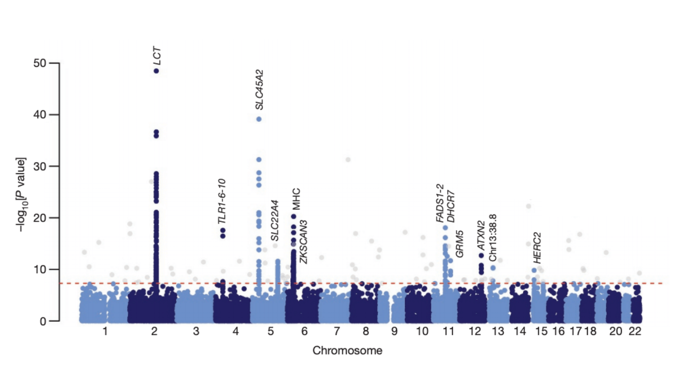{.r-stretch fig-align="center"}

## Sequencing Data

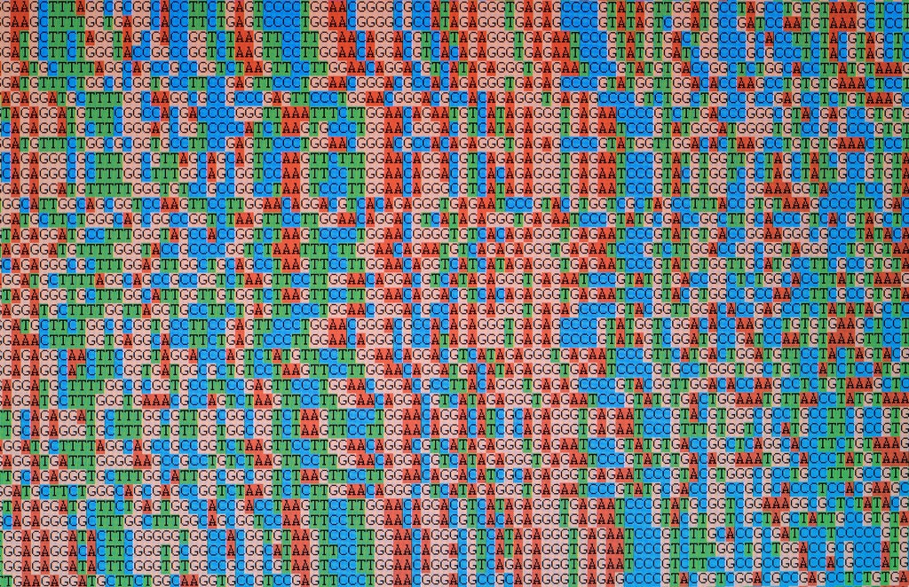{.r-stretch fig-align="center"}

## What do we want?

:::{.incremental}
- Look at patterns in our data $\Rightarrow$ figure out what situations would give rise to those patterns
- Work backwards:
  - Make assumptions: population size history, strength of selection, etc.
  - Input: Sequencing data
  - Output: Probability of data
  - Assumptions \& Data $\stackrel{\text{model}}{\rightarrow}$ Probability
:::

## How do we do this?

:::{.incremental}
- We build a model
- What's a model?
- Model: a simplified but tractable representation of the real world
:::

## Calculating the area of California

{.r-stretch fig-align="center"}


## A Model for California

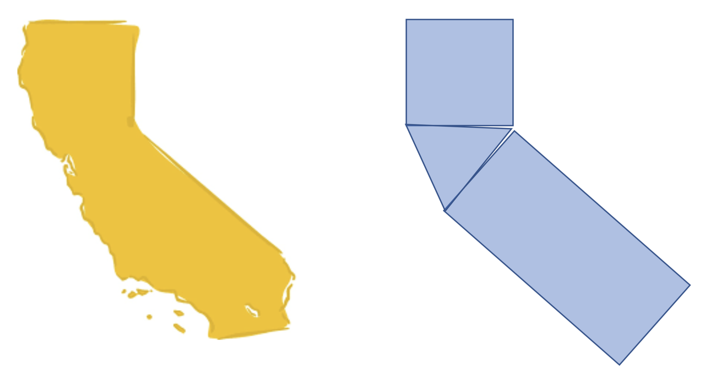{.r-stretch fig-align="center}

## George P. Box

::::{.columns}
:::{.column}
- From Wikipedia: British statistician, who worked in the areas of quality control, time-series analysis, design of experiments, and Bayesian inference. He has been called "one of the great statistical minds of the 20th century".
- "all models are wrong, but some are useful"
:::
:::{.column}
{.r-stretch fig-align="center}
:::
::::

## Let's build a *model*!

{.r-stretch}

## Simplifying Reality {.smaller}

:::{.incremental}
- Population dynamics $\Rightarrow$ super complex... let's simplify
- Focus on one location in genome (a single base-pair or gene)
- Two possibilities ("alleles") at this site: <span style="color:red;">Mario</span> and <span style="color:green;">Luigi</span>
- Fixed population size $N$
- Time measured in generations
- All offspring born at the same time
- Offspring randomly choose parent from previous generation
:::


## Wright-Fisher Model

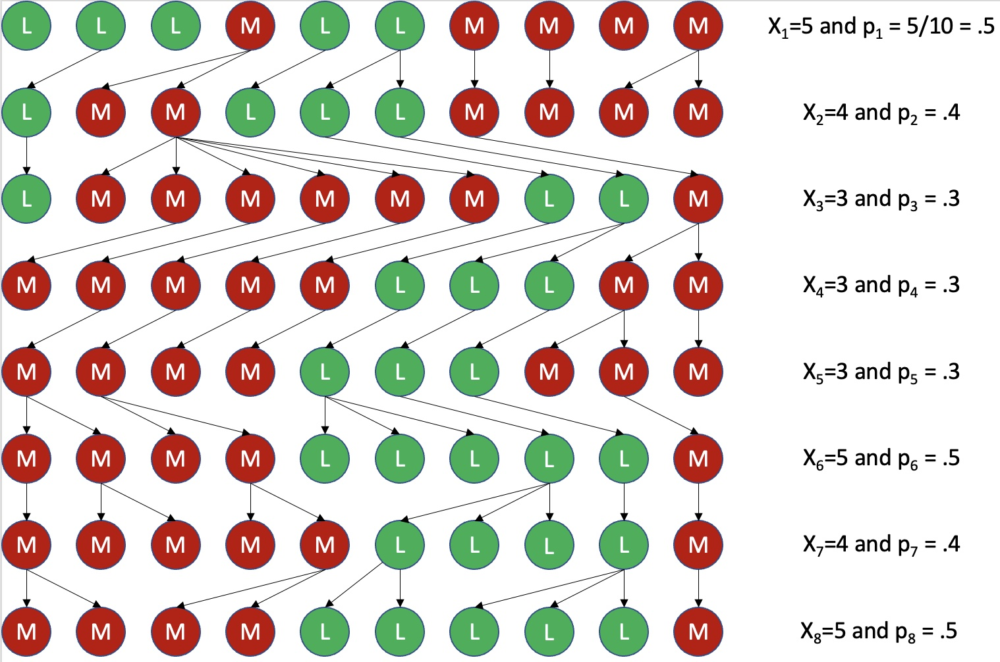

## Wright-Fisher Model

```{r, fig.align="center"}
data <- data.frame(x = 0:8, y = c(0.5, 0.4, 0.3, .3,.3,.5,.4,.5,.5))
ggplot(data = data, aes(x =x, y= y)) +
  geom_step() +
  xlim(0, 8) +
  ylim(0, 1) +
  xlab("Generation") +
  ylab("Luigi Proportion")
```

## We know this distribution!

:::{.incremental}
-   If we know $p_k$... what is the distribution of $X_k$?
-   Binomial!!!
-   Specifically Binomial($N$, $p_k$)
:::

## We can simulate this!

One generation:

```{r}
#| echo: TRUE

N <- 10 # Population size is 10
x1 <- 5 # Start with 5 Luigies
p1 <- x1 / N
x2 <- rbinom(1, N, p1)
x2
```

## We can simulate this!

Two generations:

```{r}
#| echo: TRUE

p2 <- x2 / N
x3 <- rbinom(1, N, p2)
x3
```

## We can simulate this!

Ten generations:

```{r}
#| echo: TRUE
x <- rep(0, 10)
x[1] <- x1
for(i in 1:9){
  p <- x[i] / N
  x[i+1] <- rbinom(1, N, p)
}
x
```

## We can simulate this!

-   What if we have 1,000 individuals in a population and we wanted to simulate it for 1,000 generations?!?

. . .

-   Pffft... easy

```{r}
#| echo: TRUE

N <- 1000
x <- rep(0, 1000)
x[1] <- 500
for(i in 1:999){
  p <- x[i] / N
  x[i+1] <- rbinom(1, N, p)
}
x
```

## A few Simulations

```{r}
set.seed(1988)
reps <- 1000
pop_size <- 1000
init <- .5
gens <- 1000
final_prob <- 0
p <- matrix(nrow=reps, ncol=gens)
p[ ,1] = init
steps <- pop_size
for(i in 2:gens){
      p[, i] = rbinom(reps, size=pop_size, prob=p[,i-1])/pop_size
}

p_melted <- melt(p[1:3,])
ggplot(aes(x = X2, y = value, color=as.factor(X1)), data=p_melted) +
geom_line() +
xlab("Generations") +
ylab("Luigi Proportion")+
ylim(0, 1) +
theme(legend.position="none")
```

## Lots of Simulations

```{r}
p_melted <- melt(p)
ggplot(aes(x = X2, y = value, color=as.factor(X1)), data=p_melted) +
geom_line(alpha=0.7, lwd=.3) +
xlab("Generations") +
ylab("Luigi Proportion")+
ylim(0, 1) +
theme(legend.position="none")
```

## Lots of Simulations: Cross-Section

```{r}
ggplot(aes(x = X2, y = value, color=as.factor(X1)), data=p_melted) +
geom_line(alpha=0.7, lwd=.3) +
geom_vline(aes(xintercept=100), color="red") +
xlab("Generations") +
ylab("Luigi Proportion")+
ylim(0, 1) +
theme(legend.position="none")
```

## Lots of Simulations: Cross-Section

```{r}
y_max <- 8
p_melted |>
filter(X2 == 100) %>%
ggplot(aes(x = value), data = .) +
geom_histogram(aes(y = after_stat(density))) +
  # geom_density() +
  ylim(0,y_max) +
  ylab("") +
  xlab("Luigi Proportion 100 Generations")
```

## Lots of Simulations: Cross-Section

```{r}
ggplot(aes(x = X2, y = value, color=as.factor(X1)), data=p_melted) +
geom_line(alpha=0.7, lwd=.3) +
geom_vline(xintercept=seq(100, 1000, 100), color="red") +
xlab("Generations") +
ylab("Luigi Proportion")+
ylim(0, 1) +
theme(legend.position="none")
```

## Lots of Simulations: Cross-Section

```{r}
p_melted |>
filter(X2 == 100) %>%
ggplot(aes(x = value), data = .) +
geom_histogram(aes(y = after_stat(density))) +
  # geom_density() +
  ylim(0,y_max) +
  ylab("") +
  xlab("Luigi Proportion 100 Generations")
```

## Lots of Simulations: Cross-Section

```{r}
p_melted |>
filter(X2 == 200) %>%
ggplot(aes(x = value), data = .) +
geom_histogram(aes(y = after_stat(density))) +
  # geom_density() +
  ylim(0,y_max) +
  ylab("") +
  xlab("Luigi Proportion 200 Generations")
```

## Lots of Simulations: Cross-Section

```{r}
p_melted |>
filter(X2 == 300) %>%
ggplot(aes(x = value), data = .) +
geom_histogram(aes(y = after_stat(density))) +
  # geom_density() +
  ylim(0,y_max) +
  ylab("") +
  xlab("Luigi Proportion 300 Generations")
```

## Lots of Simulations: Cross-Section

```{r}
p_melted |>
filter(X2 == 400) %>%
ggplot(aes(x = value), data = .) +
geom_histogram(aes(y = after_stat(density))) +
  # geom_density() +
  ylim(0,y_max) +
  ylab("") +
  xlab("Luigi Proportion 400 Generations")
```

## Lots of Simulations: Cross-Section

```{r}
p_melted |>
filter(X2 == 500) %>%
ggplot(aes(x = value), data = .) +
geom_histogram(aes(y = after_stat(density))) +
  # geom_density() +
  ylim(0,y_max) +
  ylab("") +
  xlab("Luigi Proportion 500 Generations")
```

## Lots of Simulations: Cross-Section

```{r}
p_melted |>
filter(X2 == 600) %>%
ggplot(aes(x = value), data = .) +
geom_histogram(aes(y = after_stat(density))) +
  # geom_density() +
  ylim(0,y_max) +
  ylab("") +
  xlab("Luigi Proportion 600 Generations")
```

## Lots of Simulations: Cross-Section

```{r}
p_melted |>
filter(X2 == 700) %>%
ggplot(aes(x = value), data = .) +
geom_histogram(aes(y = after_stat(density))) +
  # geom_density() +
  ylim(0,y_max) +
  ylab("") +
  xlab("Luigi Proportion 700 Generations")
```

## Lots of Simulations: Cross-Section

```{r}
p_melted |>
filter(X2 == 800) %>%
ggplot(aes(x = value), data = .) +
geom_histogram(aes(y = after_stat(density))) +
  # geom_density() +
  ylim(0,y_max) +
  ylab("") +
  xlab("Luigi Proportion 800 Generations")
```

## Lots of Simulations: Cross-Section

```{r}
p_melted |>
filter(X2 == 900) %>%
ggplot(aes(x = value), data = .) +
geom_histogram(aes(y = after_stat(density))) +
  # geom_density() +
  ylim(0,y_max) +
  ylab("") +
  xlab("Luigi Proportion 900 Generations")
```

## Lots of Simulations: Cross-Section

```{r}
p_melted |>
filter(X2 == 1000) %>%
ggplot(aes(x = value), data = .) +
geom_histogram(aes(y = after_stat(density))) +
  # geom_density() +
  ylim(0,y_max) +
  ylab("") +
  xlab("Luigi Proportion 1000 Generations")
```

## Adding Complexity

:::{.incremental}
- What's going to happen eventually?
  - All <span style="color:red;">Marios</span> or all <span style="color:green;">Luigis</span>
- Mutation: Occasionally <span style="color:red;">Mario</span> mutates into <span style="color:green;">Luigi</span> (and vice versa)
  - Adding Mutation to Model: Suppose with some small probability a Mario mutates to a Luigi and a Luigi Mutates to a Mario
:::

## We know this distribution

:::{.incremental}
- What is the distribution of the number of mutant Marios/Luigis if we know the number of Marios/Luigis and the probability of mutation...
- BINOMIAL AGAIN!!
- Now: Allele frequency wants to go into boundary, but mutation pushing it back in a little bit... eventually these forces of evolution balance
:::

## Stationary Distribution

```{r}
set.seed(1988)
reps <- 1000
pop_size <- 1000
init <- .5
gens <- 1000
mut <- 10^(-4)
final_prob <- 0
p <- matrix(nrow=reps, ncol=gens)
p[ ,1] = init
steps <- pop_size
for(i in 2:gens){
  psi <- p[,i-1]*(1-mut)+(1-p[,i-1])*mut
  p[, i] <- rbinom(reps, size=pop_size, prob=psi)/pop_size
}

p_melted <- melt(p)
p_melted |>
filter(X2 == 1000) %>%
ggplot(aes(x = value), data = .) +
geom_histogram(aes(y = after_stat(density))) +
  # geom_density() +
  ylim(0,y_max) +
  ylab("") +
  xlab("Luigi Proportion 1000 Generations")
```

## How do we use this for inference?

- Shape of stationary distribution depends on populations size
- Look at distribution of allele frequencies... pick population size which produces stationary distribution

# Genetic Hitchiking

## Genetic Hitchhiking

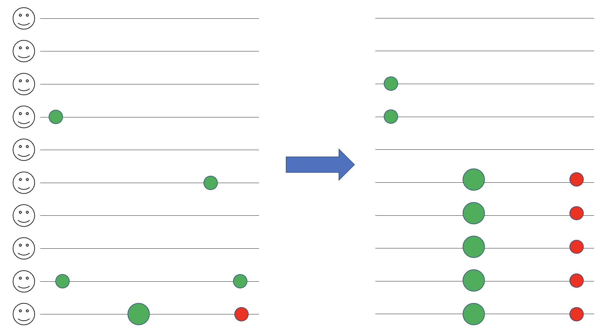


## Cross-Over Recombination

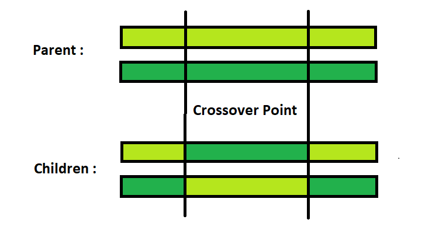


## Genetic Hitchhiking

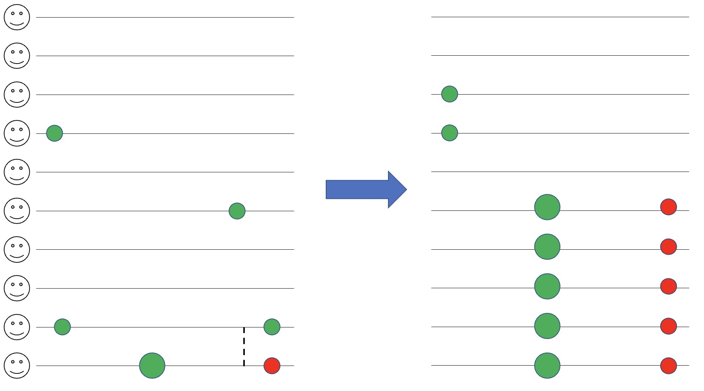


## Genetic Hitchhiking

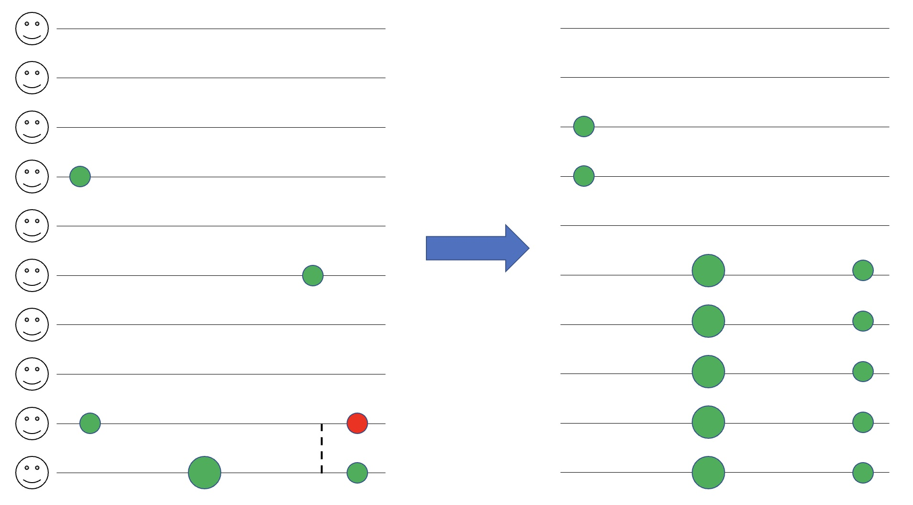


## Linkage has confounding effect on genetic analyses

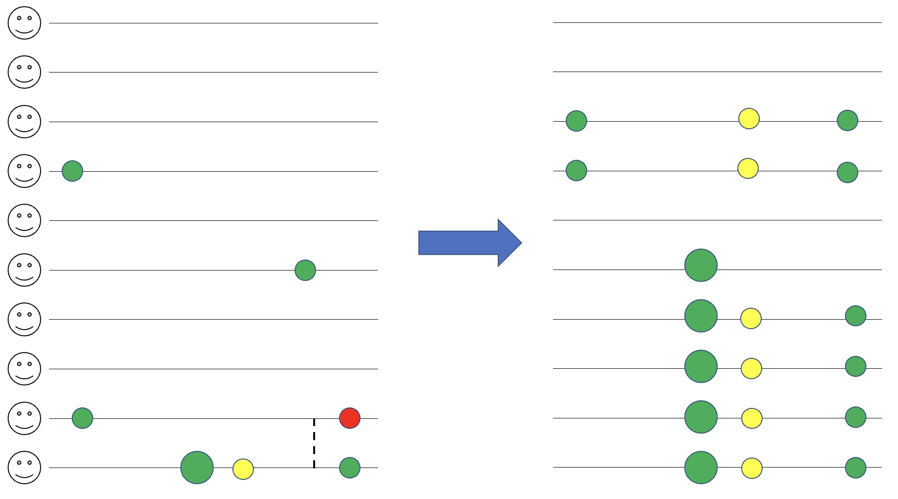


## Selection leaves its signature on the genome

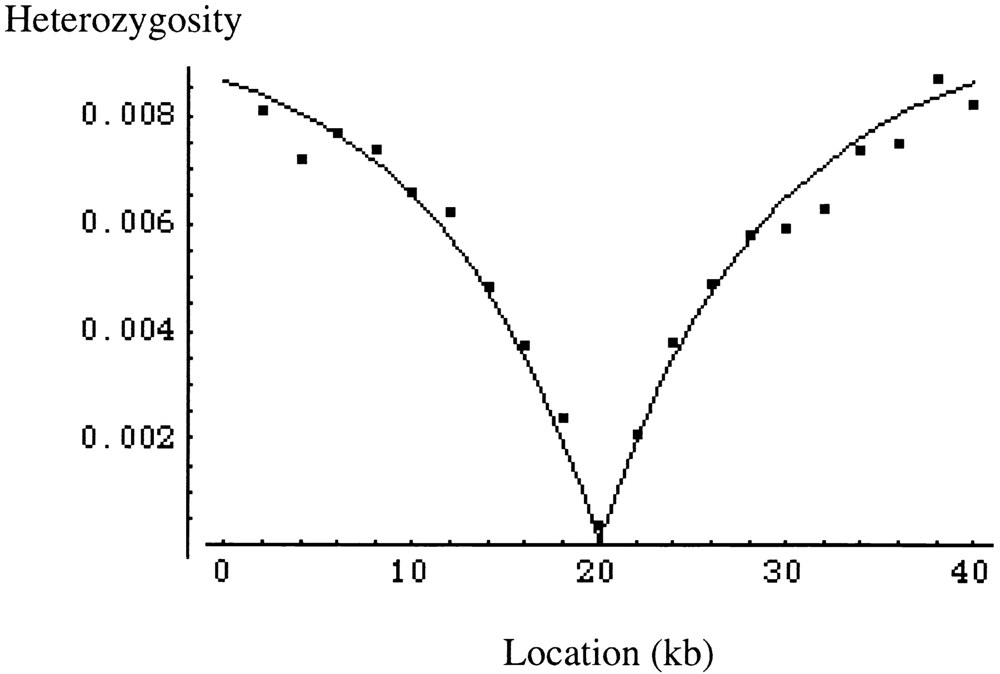

# Industrial Engineering


## Load Balancing

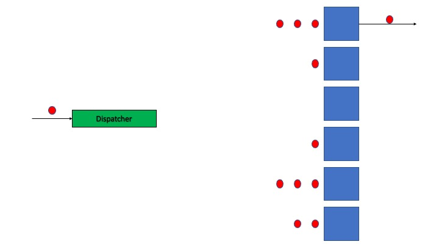

## Random Routing
  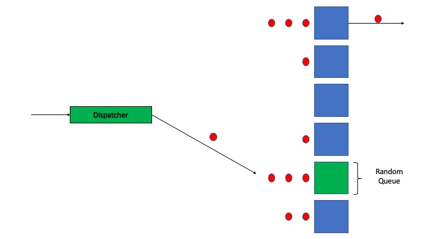

## Power of Two

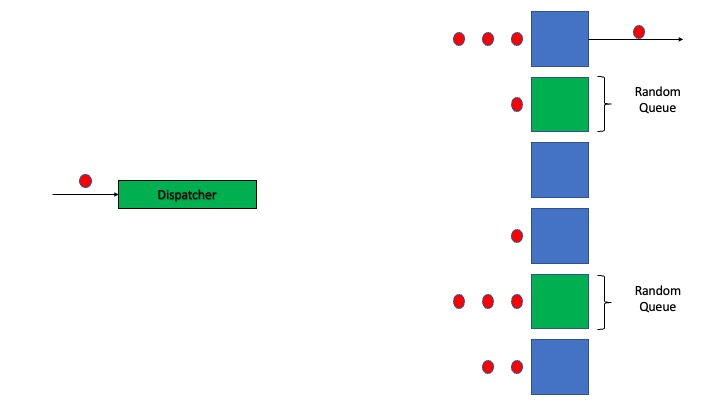

## Power of Two

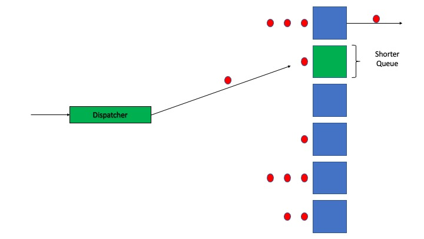

## We know that distribution!!

:::{.incremental}
-   What do you think we should use to model the interarrival times of jobs?
  -   Exponential with rate $n\lambda$
-   What do you think we should use to model the processing times?
  -   Exponential with rate $1$
-   My PhD... what happens when we sent $n\to\infty$?
:::

## Steady State Distributions

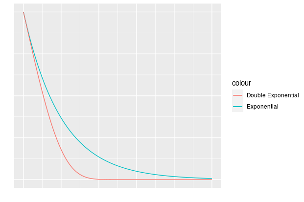

## Join-the-Shortest-Queue

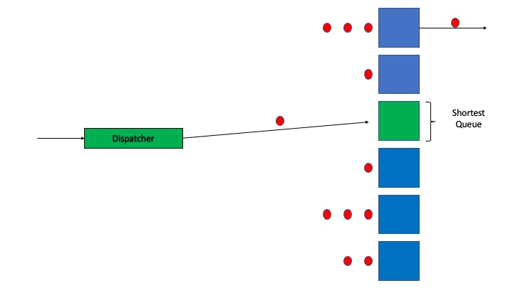


